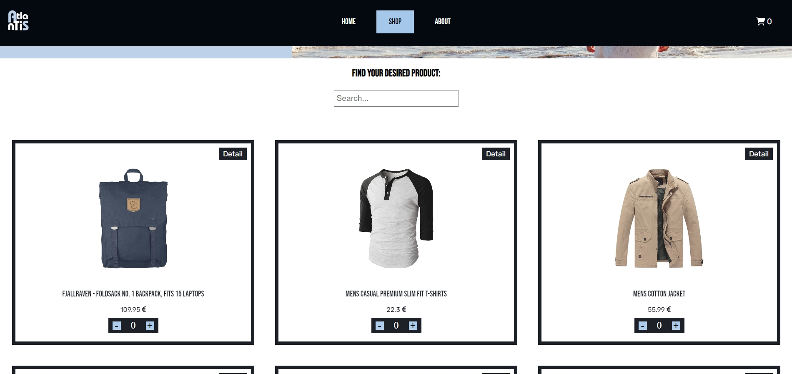

# Atlantis

Atlantis is a shopping cart project that takes data from a fake shop API and displays it in a new user interface. Browse through the products, find detailed information about them, and add them to the cart.

live preview: https://atlantis-eshop.netlify.app


## Screenshots

### Home page


### Browse through products and add them to cart



### About page


### See your selected products in cart page


## Development

Code is written in JavaScript. I am using React framework.

### Libraries, extensions and tools
* React Router Dom
* ESLint
* Prettier

## How to run

To clone and run this application, you'll need Git and Node.js (which comes with npm) installed on your computer. From your command line:

```javascript
// Clone this repository
 https://github.com/adam-horvath8/Atlantis-shop.git

//  Enter created folder
cd Atlantis-shop

// Install dependencies
npm install

// Run the app
npm run dev